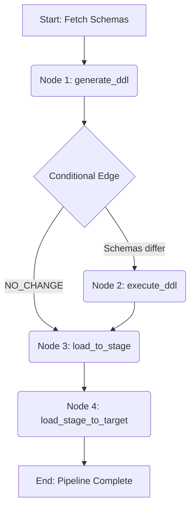

# Agentic ETL Pipeline: LLM-Driven Schema Evolution & Data Sync

An intelligent, agent-based ETL pipeline that leverages **Large Language Models (via Groq)** to automatically compare source and target schemas, generate and validate DDL (`CREATE`/`ALTER`), and orchestrate data loading using **AWS Glue (PySpark)** and **LangGraph**.

Unlike traditional rule-based ETL scripts, this pipeline uses an LLM agent to understand schema differences in natural language and write the exact SQL required to synchronize them before loading data.

---

## 🏗️ Architecture & Workflow (LangGraph)

The pipeline is built as a state machine using **LangGraph**, ensuring robust execution, conditional routing, and error handling.

## Code :
**generate_ddl:** Fetches the MySQL and Snowflake schemas, constructs a prompt, and calls the LLM (Llama 3.1 via Groq) to compare them. It generates a summary and the necessary DDL. It also runs a safety check to block unsafe keywords (DROP, DELETE, etc.).

**execute_ddl:** Receives the validated DDL from the LLM and executes it against Snowflake using Spark's postactions.

**load_to_stage:** Reads the full dataset from the MySQL source table and writes it into a staging table (_STG) in Snowflake.

**PipelineState (TypedDict):** Defines the state schema for LangGraph, tracking table names, schemas, generated DDL, and errors across nodes.

**_validate_ddl() :** A critical safety guardrail that scans the LLM's output for destructive keywords (DROP, TRUNCATE, DELETE) to prevent accidental data loss.

**_build_prompt():** Dynamically constructs the prompt for the LLM, injecting the source/target schemas and strict formatting rules.

**route_after_ddl_gen():** The conditional edge in LangGraph that skips DDL execution if the LLM determines the schemas are identical (NO_CHANGE).

**INFORMATION_SCHEMA:**  Fetches metadata directly from MySQL and Snowflake system tables to pass clean schema definitions to the LLM.
